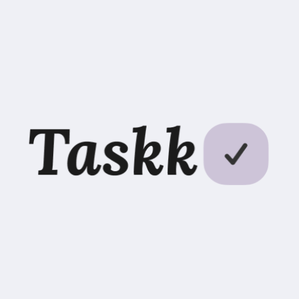
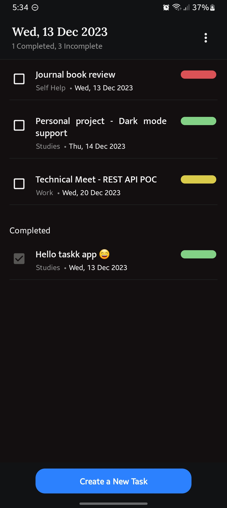
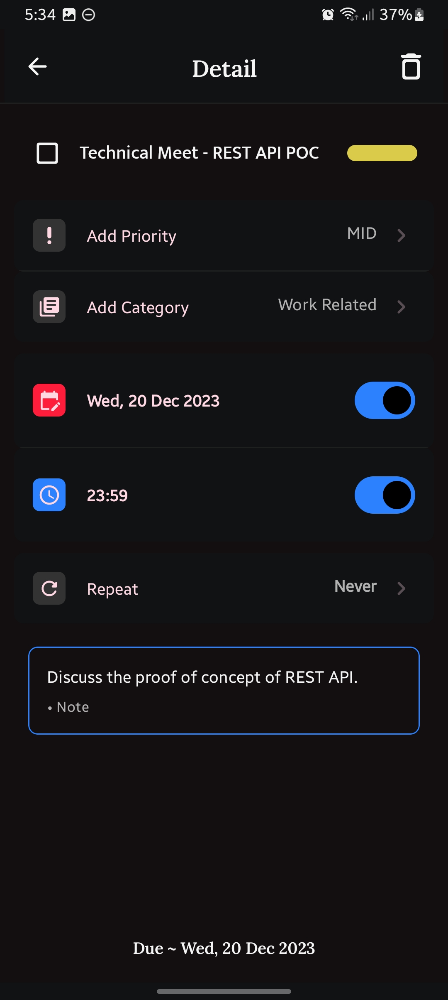
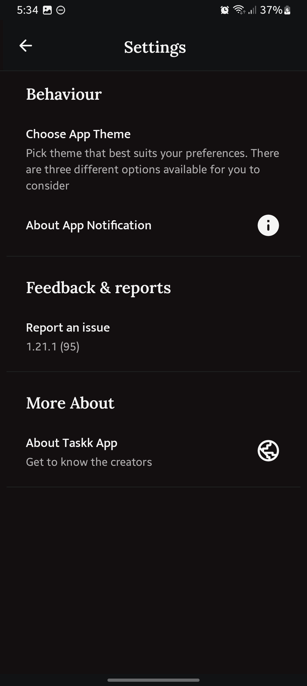

# Taskk App
<table>
  <tr>
    <td>
       
    <p> Taskk is a basic to-do app, offering task prioritization (easy, medium, hard), categorization (study, work, gym, etc.), due dates, and note-taking.
        I created Taskk because I was fed up with the lag and frustration I experienced while using Notion Apps on my Android device for my daily planning. 
        Plus, I was itching to dive into Jetpack Compose and learn the ropes of app development with it.
      </p> 
    </td>
  </tr>
</table>
<table>

<table>
  <tr>
     <td>Home</td>
     <td>Detail</td>
     <td>Setting</td>
  </tr>
  <tr>
    <td></td>
    <td></td>
    <td></td>
  </tr>
</table>

## More About
100% build using Jetpack Compose 
- You can see the dependencies that I used [here](https://github.com/gusentanan/taskk/blob/main/app/build.gradle.kts)
```
I haven't programmed this app to collect any personal information. All data,
including app preferences (such as themes), is stored solely on your device and
can be easily deleted by clearing the app's data or uninstalling it.
```
## How to use it ? 
Download the .apk or Clone this repository and make sure you're using the latest version of Android Studio
- Run the project (in debug mode) using
  
  ```sh
  ./gradlew assembleDebug
  ```

## What comes next ?
- Group list of task based on user needs 

There's still plenty of room for improvement, but I'll definitely get in touch when I'm feeling more energized! 😄
  
